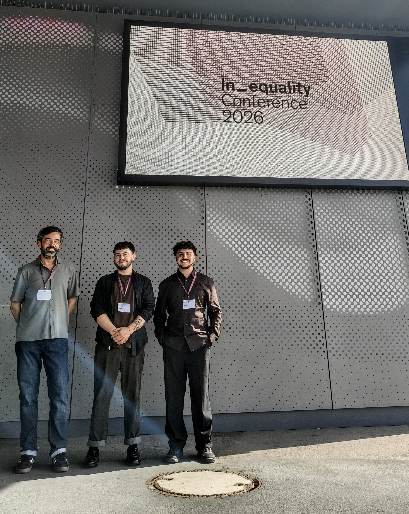
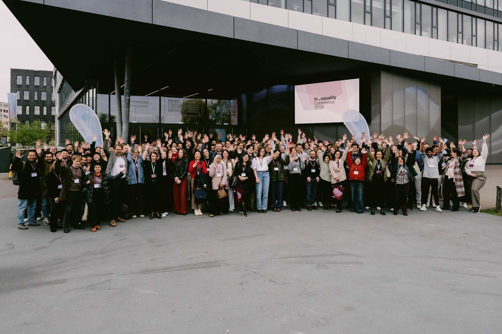
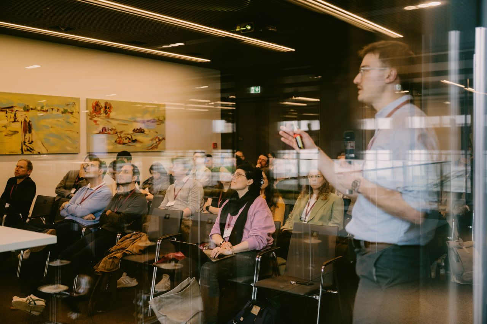
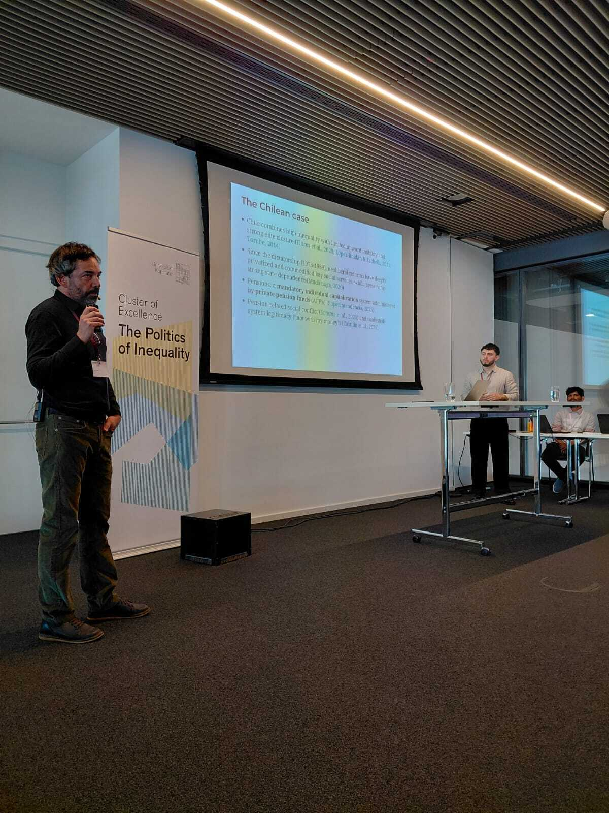

::: {.columns}
::: {.column width="60%"}
¡El equipo JUSMER participó en la In_equality Conference 2026 en Konstanz! 🌍📚
[Foto 1: equipo JUSMER en la conferencia]
Entre el 15 y el 17 de abril, el equipo JUSMER participó en la In_equality Conference 2026, celebrada en el Bodenseeforum de Konstanz, Alemania. 
La conferencia reunió a investigadoras e investigadores internacionales para discutir las causas y las consecuencias políticas de la desigualdad en distintos ámbitos, entre ellos la educación, el mercado laboral, la salud, los derechos de las minorías y el cambio climático.
:::

::: {.column width="40%"}

<small>(De izquierda a derecha: Juan Carlos Castillo, Andreas Laffert y Tomás Urzúa).</small>

:::
:::

<small>(📷 By: Ines Janas)</small>

Este año, el programa contó con 43 paneles, 116 ponencias y dos mesas redondas, consolidándose como una instancia académica muy relevante para conocer y discutir la investigación de vanguardia sobre desigualdad desde distintas perspectivas teóricas, metodológicas y empíricas.

<small>(📷 By: Ines Janas)</small>

Durante los tres días de la conferencia, el equipo JUSMER asistió a diversas presentaciones, keynotes, paneles y mesas de discusión y participó en espacios de intercambio académico con investigadoras e investigadores de distintas partes del mundo. Fue una valiosa oportunidad para conocer nuevos trabajos, dialogar sobre hallazgos recientes y plantear preguntas en torno al estudio de la desigualdad.

<small>(Juan Carlos Castillo y Andreas Laffert)</small>

La presentación del equipo se realizó el 16 de abril en el Panel 17: Meritocracy and Inequality Beliefs. En esta instancia, Juan Carlos Castillo y Andreas Laffert presentaron la ponencia [“Justification trajectories for pension inequality in Chile (2016-2023). The role of social class and beliefs in meritocracy”](https://jus-mer.github.io/stratification-market-justice/presentations/In_equality-Conference-2026/In_equality-Conference-2026.html#/justification-trajectories-for-pension-inequality-in-chile-20162023), basada en un artículo recientemente publicado en Frontiers. La exposición abordó las justificaciones de la desigualdad en las pensiones en Chile, destacando el papel de la clase social y de las creencias meritocráticas. Además, incorporó nuevos resultados del proyecto JUSMER sobre la medición multidimensional de las creencias meritocráticas y su relación con las preferencias por la justicia de mercado en materia de pensiones, lo que propició un diálogo enriquecedor con colegas que investigan temas afines.

La participación en la In_equality Conference 2026 fue una excelente instancia para difundir el trabajo del proyecto, fortalecer vínculos académicos y seguir desarrollando una agenda de investigación sobre desigualdad, meritocracia y la legitimación de arreglos sociales basados en el mercado. 📝

<small>(📷 By: Andreas Laffert)</small>

Todo esto tuvo lugar en la hermosa ciudad de Konstanz, en el sur de Alemania, un entorno ideal para compartir ideas, discutir la evidencia y seguir pensando críticamente sobre los desafíos actuales de la desigualdad. En este contexto, el equipo también se encontró con Julio Iturra Sanhueza (PhD BIGSSS, Universität Bremen), investigador visitante JUSMER. 