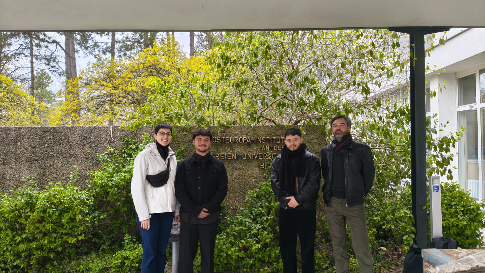
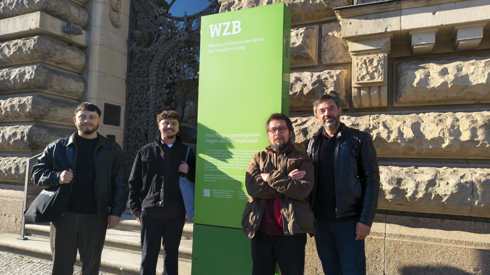
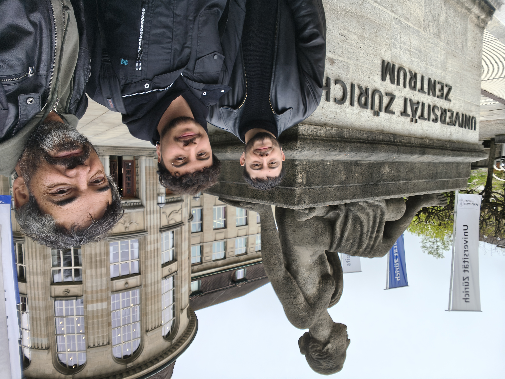

Recientemente, parte de nuestro equipo de investigación realizó una visita académica a Alemania y Suiza, en el marco de una agenda orientada al fortalecimiento de las redes internacionales de colaboración. La visita incluyó presentaciones y reuniones de trabajo en Berlín, Zürich y Konstanz.

La ruta del viaje estuvo marcada por los siguientes hitos:

- Visita a Wissenschaftszentrum Berlin (WZB): Pudimos reunirnos con Agustina Marqués, candidata a doctora del WZB, donde nos presentó parte de su proyecto de tesis doctoral.

- Reunión en Freie Universität Berlin: Tuvimos la oportunidad de estar con Claudia Traini, investigadora postdoctoral, y compartir investigaciones en desarrollo. Nuestro equipo presentó dos estudios enfocados en la comprensión multidimensional de la meritocracia y su relación con la justicia de mercado. [Link de la presentación](https://jus-mer.github.io/stratification-market-justice/presentations/FU_april_2026/FU_april_2026.html#/market-justice-meritocracy-deservingness).

- Reunión en Zürich: Compartimos con Sandra Gilgen, investigadora postdoctoral de la Universität Zürich, con quien discutimos sobre experimentos distribucionales de encuestas, donde aprovechamos de presentar un conjoint que se encuentra en desarollo. [Link del documento](https://jus-mer.github.io/experiment-jusmer/conjoint-proposal.html).

Los encuentros se caracterizaron por la discusión académica, abordando desafíos actuales y oportunidades de innovación en sus respectivas áreas de especialización. Estas instancias de intercambio académico permitieron no sólo compartir trabajos en curso, sino también identificar convergencias temáticas y metodológicas entre los equipos participantes. Como resultado de este encuentro, se establecieron bases para desarrollar futuras colaboraciones internacionales, incluyendo la proyección de iniciativas conjuntas tales como publicaciones académicas y proyectos de investigación.

<small>De izquierda a derecha: Claudia Traini, Tomás Urzúa, Andreas Laffert y Juan Carlos Castillo.</small>

<small>De izquierda a derecha: Andreas Laffert, Tomás Urzúa, Julio Iturra y Juan Carlos Castillo</small>

<small>De izquierda a derecha: Andreas Laffert, Tomás Urzúa y Juan Carlos Castillo</small>